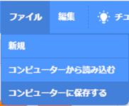

# 1.はじめに

このドキュメントでは、Scratch 3.0で基本的な部品を使った『猫が歩く』アニメーションの作成方法を説明します。

This document explains how to create a "cat walking" animation using basic item in Scratch 3.0.

ドキュメント作成者：高橋 悦子(NTTテクノクロス株式会社)

Document Author：Etsuko Takahashi(NTT TechnoCross Corporation)

# 2.準備

## 2-1.準備①：開発環境(Preparation①:Development environment)

- [Scratch公式サイト(https://scratch.mit.edu/download)](https://scratch.mit.edu/download)から、Scratch 3.0をダウンロード、インストールします。(Scratch 3.0は、Windows、macOS、chromeOS、Androidに対応。(2020/04/13時点))

   Download and install Scratch 3.0 from the [Scratch official website(https://scratch.mit.edu/download)](https://scratch.mit.edu/download).(Scratch 3.0 is compatible with Windows, macOS, chromeOS, Android. (As of 2020/04/13))

# 3.アニメーションの作り方(How to develop animation)

## 3-1.アニメーションを作る前の準備(Preparation before developing the animation)

- Scratch 3.0を起動し、背景を選択します。

　Start Scratch 3.0 and choose a backdrop.

- 「Beach Rio」を選択します。（他の背景でも構いません）

 Choose the "Beach Rio".(There is no problem with other background.)

- 背景が選択されていることを確認してください。

　Confirm backdrop is your choose item.

- 猫の大きさを **『100』から『30』に変更** します。

　Change the cat size from "100" to "30".

- 猫を左に移動します。

　Move the cat to the left.

## 3-2.作り方(How to develop)

### 3-2-1.完成イメージ(Completed image)

### 3-2-2.詳細(Details)

- コードの  を押してください。「動き」についてのブロックが選べるようになります。

   Press  on the code. You will be able to choose the "motion" block.

-  のブロックを画面中央にドラッグ&ドロップします。このブロックは、「 を押すと始まります」という意味になります。

   Drag and drop the  to the center of the screen. This block means "press the  button to start the event".

- コードの  を押してください。

   Press  on the code.

-  のブロックを画面中央にドラッグ&ドロップします。(今、猫がいる座標が数字で設定されています。)

   Drag and drop the  to the center of the screen. (Now, the coordinates where the cat is are set by numbers.)

- ブロックをくっつけてください。

   Connect the blocks.

- コードの を押してください。

   Press  on the code.

- ブロック  の **『100』を『30』に変更** してください。

   Click  block and change "100" to "30".

- ブロックをくっつけてください。ここまでで、「旗ボタンを押すと、猫が同じ場所で30%のサイズでスタートする」設定ができました。

   Connect the blocks. Up to this point, you can set up "If you press the flag button, the cat will start at the same place with a size of 30%".

- コードの を押してください。

   Press  on the code.

- ブロック  の **『1』を『0.5』に変更** してください。

  Click  block and change "1" to "0.5".

- ブロックを画面中央にドラッグ＆ドロップします。（**ブロックはくっつけません**）

   Drag and drop the block to the center of the screen. (Do not connect blocks.)

- コードの  を押してください。

   Press  on the code.

- ブロック  の **『10』を『20』に変更** してください。

   click  block and change "10" to "20".

- ブロックを画面中央にドラッグ＆ドロップして、にくっつけます。

   Drag and drop the block to the center of the screen and connect to .

- コードの を押してください。

   Press  on the code.

- ブロック  を画面中央にドラッグ＆ドロップして、ブロックにくっつけます。

   Drag and drop the  block to the center of the screen and connect to blocks.

- ブロック  を画面中央にドラッグ＆ドロップして、ブロックにくっつけます。

   Drag and drop the  block to the center of the screen and connect to blocks.

- コードの を押してください。

   Press  on the code.

- ブロック  の **『10』を『17』に変更** してください。

  Click  block and change "10" to "17".

- ブロックを画面中央にドラッグ＆ドロップします。（**ブロックはくっつけません**）

   Drag and drop the block to the center of the screen. (Do not connect blocks.)

- 以下のブロックを、 の中に入れます。

   The following blocks into 

- 画面中央が以下のようになっていることを確認してください。

   Confirm that the center screen.

- ブロックをくっつけてください。これでプログラムは完成です。

   Connect the blocks.The program is complete.

# 4.プログラムの保存方法(How to save the program)

Scrachのファイルのメニューから『コンピューターに保存する』を選択し、実行してください。

   From the Scrach file menu, select "Save to computer" and run it.

# 5. プログラムの実行・停止(How to run and stop the program)

## 5-1. プログラムを実行(Run the program)

旗のボタンを押してください。

Press the flag button.

## 5-2. プログラムを停止(Stop the program)

赤いボタンを押してください。

Press the red button.

